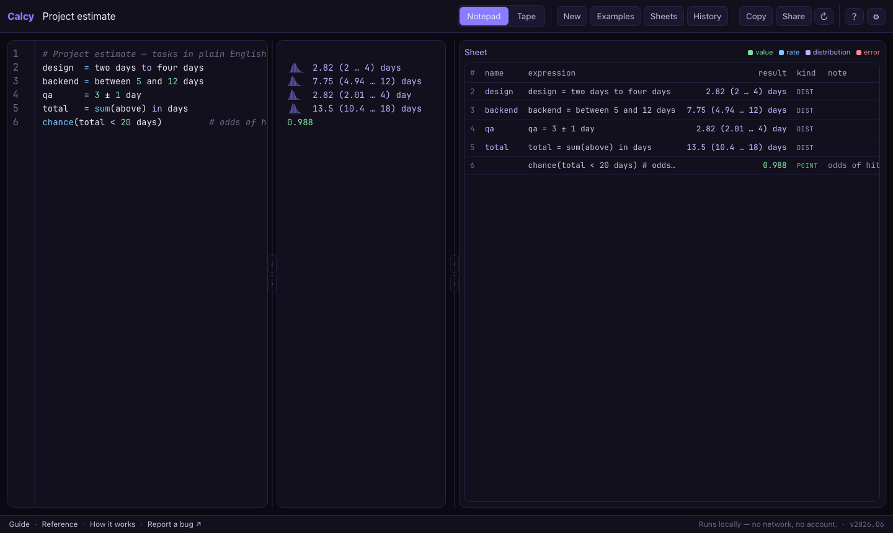

# calcy — unit-aware, uncertainty-propagating calculator

[](https://npalladium.github.io/calcy/)
[](LICENSE)
[](https://npalladium.github.io/calcy/)
[](#privacy)

A pure, offline, installable PWA notepad that does three things at once:

1. **Unit-aware math**—`5 km + 3 mi`, `60 km / 1 h → speed`, with strict
   dimensional checking (`5 km + 3 s` is an error, not a silent number).
2. **Uncertainty math**—`800 to 1200` is a 90% confidence interval; arithmetic is
   Monte-Carlo by default (exact where the math allows), so ranges propagate
   through every operation.
3. **Rate reasoning**—type a rate (`12k req/s`) and instantly see it per
   second…year, and **accumulate** it over any window into a total.

Built on those: **scenarios**—`scenario[case](low: 8, base: 10, high: 14)` holds
several labelled outcomes in one line and composes them through your whole sheet
(`pick` one, or collapse with `max(… over case)`)—and **correlation**—
`correlate(a, b, r)` couples two uncertain values at a target rank correlation so
the dependency shows up in whatever you compute next.

Everything runs client-side. No backend, no accounts, no telemetry, no network
after install.



## Status

calcy is **beta software**, but **mostly feature-complete and mostly feature-stable**.
The engine and UI do what they set out to do, and I don't expect to add major features
or make breaking changes—though I might if I run into a compelling use-case. Expect the
odd rough edge; micro-features, polish, and bug fixes are still very welcome. See
[Contributing](#contributing) for how to report a bug or propose a feature.

## The one idea behind it

> **Every value is a _distribution_ of a _dimensioned quantity_.**

- A plain number → a 1-sample, dimensionless distribution.
- An uncertain value (`5 to 10`) → an N-sample distribution.
- A rate (`req/s`) → a quantity whose dimension contains `time⁻¹`.
- **Time-base conversion** → re-expressing that quantity in other time units.
- **Accumulation** → multiplying a rate by a duration; `time⁻¹` cancels, leaving
  a total.

Once the engine handles _(samples × units)_, rates and accumulation fall out of
ordinary arithmetic—there is no separate "rate subsystem". A rate card is just
"multiply by one second/minute/…/year and format".

## Quick start

Uses **pnpm**.

```sh
pnpm install
pnpm dev          # http://localhost:5173
pnpm build        # static output in build/ — deployable to any static host
pnpm preview      # serve the production build locally
```

Quality gates:

```sh
pnpm check        # svelte-check + tsc
pnpm lint         # biome
pnpm lint:svelte  # eslint (svelte-plugin), .svelte files only
pnpm format       # biome --write
pnpm knip         # dead code / unused exports / unused deps
pnpm test         # vitest (unit, property, golden)
pnpm mutation     # stryker mutation testing
```

## Docs

The prose docs live under [`src/lib/docs/`](src/lib/docs/) as Markdown, so they
render here on GitHub and double as the in-app reader (open them from the footer
or the `⌘/` cheat sheet):

- **[Guide](src/lib/docs/guide.md)**—a short, plain-English intro to the basics.
- **[Reference](src/lib/docs/reference.md)**—the full expression language:
  units, uncertainty, money, rates, lists, functions, decibels, and more.
- **[How it works](src/lib/docs/how-it-works.md)**—the ideas behind the engine.

The in-app cheat sheet (`⌘/`) has click-to-insert examples for every feature.

## UI

- **Notepad** (default on desktop)—code editor + result gutter, per-line copy.
- **Tape** (touch-friendly)—a running value with stacked operation rows;
  compiles to the same expression the engine evaluates.
- **Rate Card**—auto-shown for rates; time-base table + accumulation + growth.
- **Sensitivity**—which input drives the most output variance.
- **Sheets**—create / duplicate / rename / search (`⌘K`); auto-persisted.
- **Starter templates**—pre-filled sheets for common cases (project estimate,
  traffic forecast, capacity & headroom, cloud cost, Fermi estimate, events &
  bursts, carbon footprint).
- **Sharing & export**—share a sheet via URL hash; export the whole store as a
  portable `.sqlite` file.

Shortcuts: `⌘K` sheets · `⌘/` help · `⌘↵` re-roll · `Esc` close.

## Architecture

All client-side. Two Web Workers keep the main thread free:

```
Svelte UI (SvelteKit, adapter-static)
  • Notepad / Tape · Rate Card · Distribution chips · Sensitivity
        │ postMessage (sheet/ops)              │ postMessage (queries)
        ▼                                      ▼
Engine Worker                            DB Worker
  • parse → AST                            • sqlite-wasm (OPFS SAH-pool VFS)
  • curated TS unit catalogue              • sheets / revisions / custom units
  • Monte-Carlo eval (seeded RNG,          • FTS5 search · settings
    correlation-by-reuse, scalar fast path)
```

Design decisions worth knowing:

- **Units are hand-owned TypeScript** (`src/lib/engine/units.ts`)—a curated,
  Frink-inspired catalogue with a generic SI-prefix expander, not a WASM units
  engine. One language, distribution-native value type, no Rust in the build.
- **Scalar fast path:** most lines are plain scalar math and stay scalar; a
  `Float64Array` of samples is allocated lazily, only when a value meets a
  distribution. This keeps live evaluation fast.
- **Persistence stores source text + seed, never the 10 000 samples**—
  distributions are recomputed deterministically on load, so the DB stays tiny
  and portable. The OPFS SAH-pool VFS needs no `SharedArrayBuffer`, so **no
  COOP/COEP headers**—it works on any static host.

### Data: backups & migrations

- **Schema migrations** run in the DB worker (`src/lib/db/worker.ts`) off
  `PRAGMA user_version`. The current `CREATE TABLE IF NOT EXISTS` schema is the
  **v1 baseline**: any database still at version 0 (or freshly created) is adopted
  as v1. To evolve the schema, append to the `MIGRATIONS` map keyed by the target
  version—`{ 2: ['ALTER TABLE sheet ADD COLUMN …'] }`—and the runner applies each
  pending step in a transaction, bumping `user_version` on success. Forward-only;
  never edit a migration that has shipped.
- **JSON backups are versioned** (`src/lib/sheet/backup.ts`). `EXPORT_VERSION`
  stamps the `{ version, exported_at, sheets, custom_units, settings }` envelope;
  `validateImport` rejects an unknown version rather than half-applying it, and
  normalises/drops malformed rows. Bump `EXPORT_VERSION` (and teach
  `validateImport` to read the older shape) whenever the envelope changes.
- **Import merges, it doesn't clobber**—the worker uses `INSERT OR IGNORE`, so
  re-importing a backup keeps existing sheets, units, and settings. The raw
  `.sqlite` import is the full-replace path. Destructive resets (clear sheets,
  reset settings, wipe storage) live behind confirms in Settings.

### Project layout

```
src/
  routes/+page.svelte           app shell
  lib/
    engine/
      worker.ts  client.ts      engine worker + typed main-thread client
      parse.ts                  expression parser → AST
      eval.ts                   AST evaluator (units + Monte-Carlo ops)
      mc.ts                     samplers, RNG, summaries
      value.ts                  Value type + dimension-signature helpers
      units.ts                  curated unit catalogue + SI prefixes
      stats.ts  format.ts       reducers · result formatting
    db/
      worker.ts  client.ts      sqlite-wasm (OPFS) worker + client
    components/                 Notepad, Tape, RateCard, Sensitivity,
                                DistributionPanel, Sparkline, CodeEditor,
                                ResultsGrid, HelpPanel
    docs/                       Guide / Reference / How it works (Markdown)
    editor.ts  tape.ts  share.ts
tests/                          vitest: unit, property (fast-check), golden
```

## Testing

`pnpm test` runs the vitest suite—unit tests, **property tests** (fast-check,
e.g. unit-conversion round-trips and distribution invariants), and **golden
tests** that pin worked examples (see the [Reference](src/lib/docs/reference.md)).
`pnpm mutation` runs Stryker to check the suite actually catches regressions. New
behaviour should add golden tests in the spec style.

## Privacy

Every computation is local. After install the app makes no network calls; there
is no account system, no server sync, no telemetry. Your sheets live in OPFS on
your device and leave only when _you_ export a `.sqlite` file or share a URL.

## Acknowledgements

calcy stands on the shoulders of these projects—code, data, and design were
adapted directly from them (see [`THIRD-PARTY-NOTICES.md`](THIRD-PARTY-NOTICES.md)
for the full notices):

- **[Rink](https://github.com/tiffany352/rink-rs)** (tiffany352)—the unit
  catalogue and unit-aware evaluation. Rink's `definitions.units` data is
  GPL-3.0.
- **[Frink](https://frinklang.org/)** (Alan Eliasen)—the unit-aware expression
  language and the breadth of the units catalogue. Inspiration only; no Frink
  code is included.
- **[distribution-calculator-android](https://github.com/NunoSempere/distribution-calculator-android)**
  (Nuño Sempere, MIT)—the "every value is a distribution" model and the
  `lo to hi` confidence-interval syntax.
- **[numutil](https://github.com/naftaliharris/numutil)** (Naftali Harris, BSD)—
  spelled-out number parsing (the `and` connector) and the "newspaper" number
  format.

## Similar apps

If calcy isn't your fit, these are excellent—and worth learning from. What none
of them do, though, is calcy's whole trick at once: **first-class units,
Monte-Carlo uncertainty, and rate/accumulation reasoning in one notepad**.
Soulver has no real uncertainty; Guesstimate and Squiggle have no first-class
units; Numbat and Frink have no distributions.

- **[Soulver](https://soulver.app/)**—natural-language notepad calculator.
- **[Numbat](https://numbat.dev/)** (and its predecessor Insect)—a unit-aware
  scientific calculator language.
- **[Qalculate!](https://qalculate.github.io/)**—a deep, unit-aware desktop
  calculator.
- **[Guesstimate](https://www.getguesstimate.com/)**—a spreadsheet for
  Monte-Carlo estimates.
- **[Squiggle](https://www.squiggle-language.com/)**—a language for probability
  distributions.

## Contributing

calcy is a small, single-maintainer project, and it's [mostly feature-stable](#status).
The two most useful ways to contribute:

- **Found a bug?** [Open an issue](https://github.com/npalladium/calcy/issues/new/choose).
  There's a bug-report template, and the in-app footer can prefill one with your sheet
  attached.
- **Want a feature?** [Start a discussion](https://github.com/npalladium/calcy/discussions)
  rather than opening a PR straight away. Because the project is feature-stable,
  let's talk through the idea and whether it fits before any code—it saves wasted effort
  on both sides.

For accepted bug fixes and small improvements, PRs are welcome; please run
`pnpm check && pnpm lint && pnpm test` and keep changes focused.

## The name

"calcy" (pronounced *Cal-see*) is what we called the calculator back in college—"hang on,
let me crunch it in the calcy." This is that calcy: the thing you reach for to work
something out, quickly.

I trained as a chemical engineer, where a misplaced unit could quietly ruin an answer—and
it caught me more than once. calcy is unit-aware largely because of that—I'd rather the
tool keep the units straight than count on getting it right myself.

What I reach for it for now is system-design estimation—capacity, throughput, cost—both in
interviews and real work, and quick time- and money-calculations where the inputs are rough
ranges rather than exact figures. Units, rates, and uncertainty, all in one place.

## License

GPL-3.0—see [`LICENSE`](LICENSE). Third-party notices for adapted code, data, and
inspiration are in [`THIRD-PARTY-NOTICES.md`](THIRD-PARTY-NOTICES.md).
